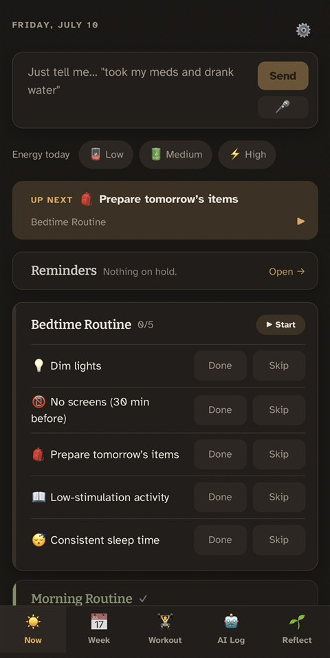
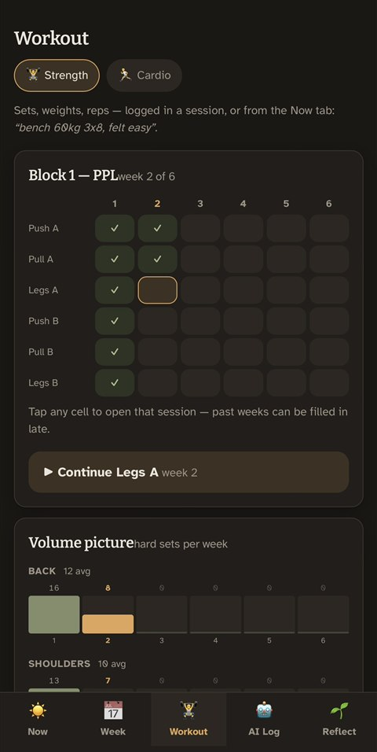
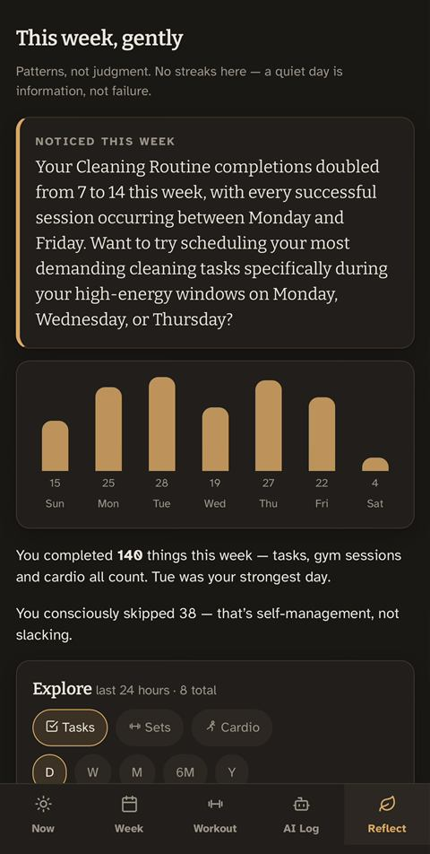
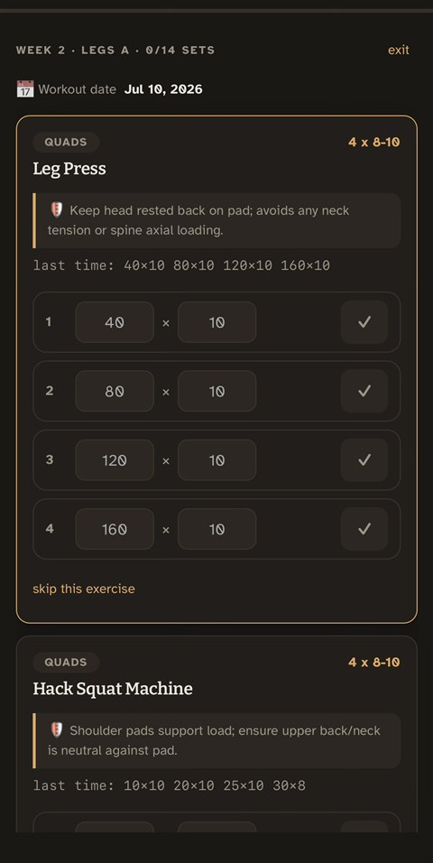
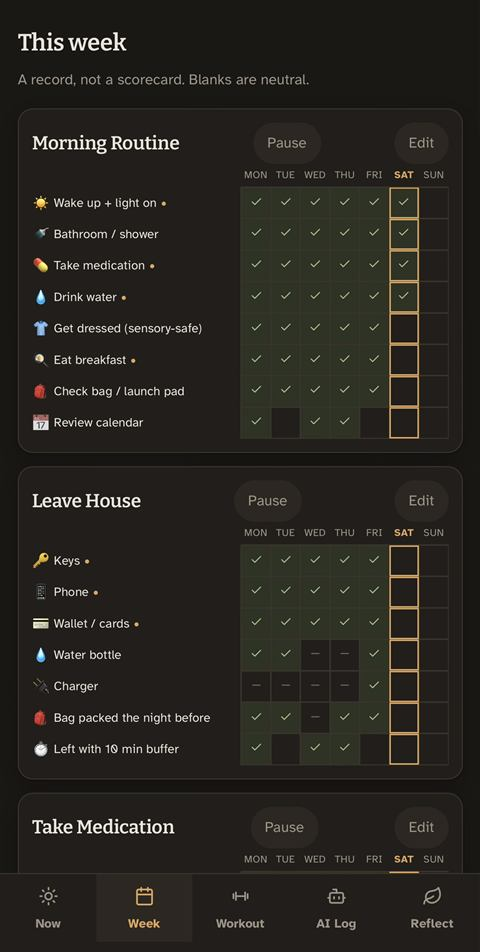
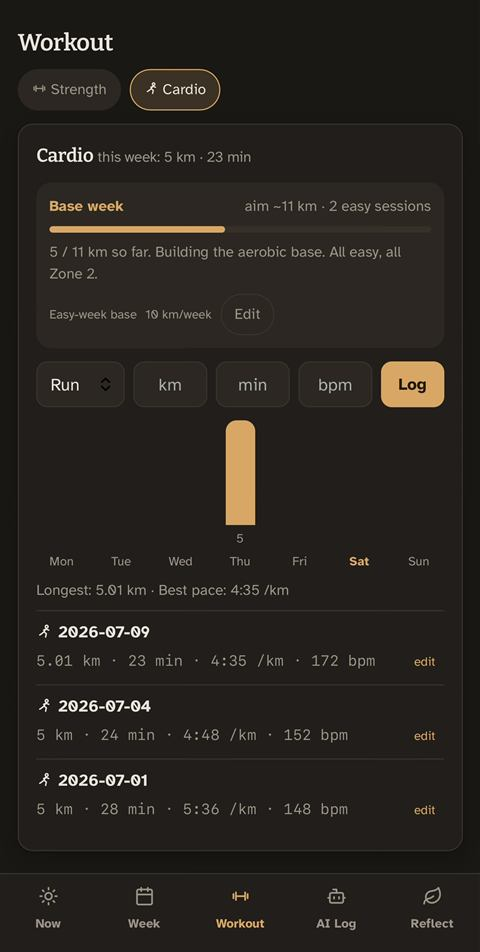
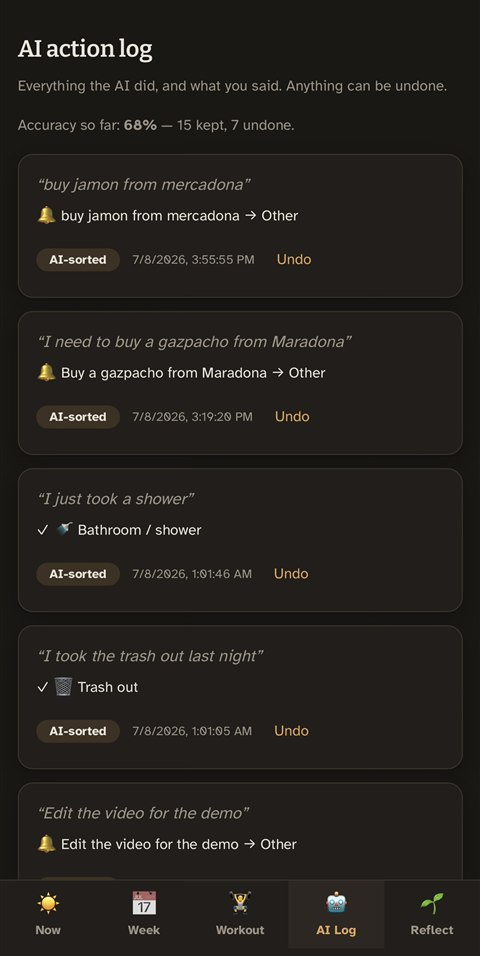
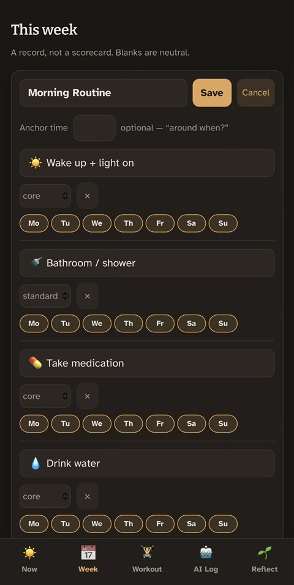
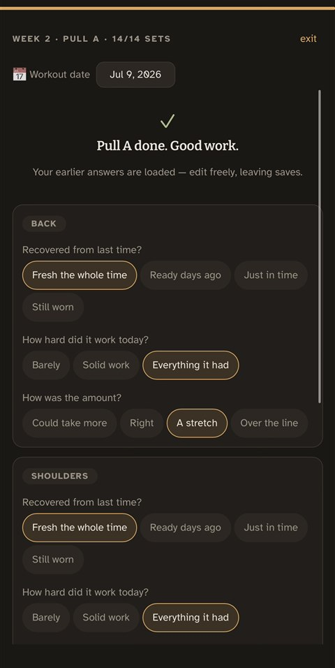
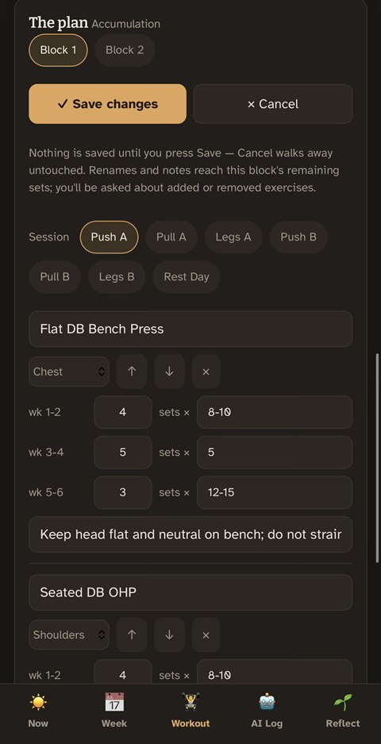

<h1 align="center">Routine Tracker</h1>

<p align="center"><em>A routine tracker that works with your brain, whatever it's like.</em></p>

<p align="center">
A routine tracker anyone can use: you just type (or say)<br>
<em>"ran 5k and did my morning routine"</em> and it ticks the right boxes for you.<br>
Built gentle enough for ADHD brains — which makes it lighter for every brain.<br>
Self-hosted and free to run, no subscription.
</p>

<p align="center"><sub>React · Supabase · Gemini · installable PWA · 7 languages · AGPL-3.0</sub></p>

<p align="center">
  <a href="https://stayuptildawn.github.io/routine-tracker/?demo"><strong>▶ Try the live demo</strong></a>
  — no account, no install; it runs entirely in your browser with a week of
  sample data (the AI composer is the one part that needs a server).
</p>

<p align="center">
  
  
  
</p>
<p align="center">
  
  
  
</p>

## Why I built this

I was managing my routines with Google Docs, and honestly it was painful. It
was unresponsive on my phone, and every small update meant scrolling around a
big table hunting for the right cell. That is way too much work for just being
spontaneous, and it demands exactly the kind of focused effort that routines
are supposed to remove from your day.

The apps made for this are mostly behind a paywall. The good ADHD planners
charge around [$3 to $12 per month](https://habi.app/insights/best-adhd-planner-apps/),
and the free tiers [keep shrinking](https://mutra.app/resources/best/best-free-adhd-planner-apps/)
as features quietly move behind the subscription. Paying a monthly fee to
manage a condition that already costs you money (people call it the
["ADHD tax"](https://affine.pro/blog/best-adhd-planner-apps)) didn't sit right
with me.

By the way, the research agrees with both complaints. If a tracker takes too
long to set up or use, ADHD brains
[abandon it before it delivers any value](https://kabitapp.com/blog/habit-tracker-adhd),
and the feature-heavy ones turn into
["productive procrastination"](https://www.mindfulsuite.com/reviews/best-habit-tracker-apps),
you spend 20 minutes looking at completion charts instead of doing the habits.
The best tracker is
[the one that takes less time to use than the habit itself](https://routinebase.com/best-habit-tracker-apps/).

So the whole idea here is one text box. You write what you did in plain words
and the AI files it. No hunting through lists, no forms, no fee.

The other reason was simple. My life was spread across too many apps. Routines
in one, workout notes in another, reminders somewhere else, and I was the one
keeping them all in sync. I just wanted one place that holds everything, so
checking my day is one move and not a hunt through five different apps.

And honestly, I don't think you need an AuDHD brain to get something out of
this. I built it around mine, but everyone has days where a list feels like too
much, or where typing *"went for a run"* is easier than tapping through menus.
Wanting less friction in your day is not only a neurodivergent thing.

I'm also nowhere near done with it. I keep adding to it, and I'd like it to fit
more people than just me. So if you have an idea, I'm happy to hear it. And if
the project is useful to you and you want to help keep it going, suggestions
and donations are both welcome.

## This app is made for you if

> ...you feel, like me, that building an app like this from scratch and washing
> the dishes land at the same spot on the scale, because the size of the task was
> never the hard part, just getting yourself to *execute* it is. If a five-minute
> chore and a five-week project feel equally heavy to start, then this was built
> for us. :)

## What it does

### ☀️ One message box that reads plain language

You just write what you did (or ask what you want to know) the way you'd say it
out loud, and the AI works out what you meant. There is no phrasing to memorize
and no command syntax, since the whole point was to remove that kind of friction,
not add a new one.

- It reads a whole messy sentence at once, and it can hold several things in one
  go. *"took my meds, drank water and benched 80 for 5"* lands as a medication
  check, a water check and a logged set, all from the one message.
- It gets the parts of how people actually talk, the exceptions and the
  negations. *"did morning routine except shower"* checks off the whole routine
  and marks the shower as skipped, and *"skip the run today"* does the opposite
  of a check without you hunting for a button.
- It knows the difference between telling it something and asking it something.
  *"low energy today"* switches the whole day to minimum mode, while *"when did
  I last refill?"*, *"what did I bench last time?"* or *"what's still
  pending?"* just reads your data back to you and writes nothing. Voice input
  works too, so you can say it instead of typing.
- Reminders understand the clock, in both directions. *"remind me to call the
  bank tomorrow at 5pm"* (or *"...in 10 mins"*) becomes a categorized reminder
  with a due time, and a push nudge fires within ~5 minutes of that hour.
  Later, *"bought the sunscreen"* clears the matching open reminder again —
  a status change, never a delete, and undo restores exactly what was there.
- The record is editable by talking, not just today's: *"did the dishes
  yesterday"* lands on yesterday's row, and undoing it fixes yesterday too.
  Cardio takes the whole story in one line — *"ran 5k in 25 min at 152 bpm,
  felt easy"* logs distance, time, heart rate and the recovery answer.
- The same brain is reachable from a **Telegram bot** (text it from anywhere,
  it replies with what it did) and from Android's **share sheet** (share text
  into the app, it lands in the message box for review).
- It scores its own confidence, so it never bluffs. What it's sure of applies
  instantly with one-tap undo, the maybes come back as "Did you mean...?" chips
  you tap to confirm, and anything it's genuinely unsure about does nothing at
  all. Every batch of actions is logged and reversible, and the log keeps a
  running accuracy score. Nothing happens silently. And to be straight about
  it: the model is not always right — my own log hovers around 70% kept. The
  design bet is different: every miss is visible in the log and one tap from
  undone, which beats a model you have to babysit.

<p align="center">
  
</p>

### 📅 Routines that adapt to the day

- Tasks have tiers (core / standard / bonus). On a low-energy day you only see
  the core minimum, and completing that still counts as a full win.
- Routines can have a time anchor ("around 8:00"). Near their time they float
  to the top with a little countdown ring — a time-blindness aid, not an alarm.
- A **routine player**: one task at a time, full screen, two big buttons, for
  the days when a list is already too much. An always-on **"Up next" strip**
  picks the single most sensible pending task (instantly, no AI call) — tap
  it and the player opens right there.
- Routines can be **paused** from the week view: hidden from the day, the AI
  and the nudges, history intact, one tap to bring back.
- Optional **push nudges**: if a routine's anchor passes and its core tasks are
  still pending, you get one gentle notification ("Morning routine is ready
  when you are") — at most once per routine per day, and never "you missed".
  Reminders with a due date get one morning nudge; give one a clock time and
  its nudge arrives at that hour instead.
- No streaks, no shame. Skips show up neutral, blanks stay blank, past days can
  be corrected from the week grid, and taps work offline (they queue and sync).

<p align="center">
  
</p>

### 🏋️ A full training module

- Your program lives as **training blocks** (6-week PPL then Upper/Lower,
  rep-wave periodization, an injury-safe execution cue on every exercise).
  One tap generates all sessions and sets for a block.
- The **session player** shows every exercise with its sets, last time's
  numbers pre-filled as placeholders (double progression made easy), and the
  safety cue pinned under the name. *"leg press 120 4x8"* typed anywhere fills
  those exact planned sets.
- After a session, an optional **recovery check-in** per muscle (how it
  recovered, how hard it worked, how the amount felt) — and if a muscle says
  "over the line" twice, you get a dismissible suggestion, never a silent plan
  edit.
- A **volume picture** (hard sets per muscle per week) and a **cardio view**
  with quick logging, weekly distance, and pace — runs, walks, cycles, swims.
- The plan is fully yours to edit: exercises, sessions, form cues, and sets ×
  reps per phase as plain fields (no format to memorize). Nothing saves until
  you press Save — Cancel really cancels, deletes are undoable until then —
  and if you change the plan mid-block, the app asks whether the running
  block's remaining sessions should pick it up or leave it for the next one.

<p align="center">
  
  
</p>

### 🌱 Reflection, gently

- Weekly bars count everything you did — tasks, gym sessions, cardio — with
  patterns instead of pass/fail.
- An **Explore chart**: tasks, hard sets or cardio km over the last 24 hours
  (hourly), 7 days, 32 days, 6 months or 12 months, with min/max/avg.
- Twice a day — a morning pass and a closing pass at night, in your own
  timezone — the AI writes two sentences about your week so far: one pattern
  it noticed, one permission-based suggestion. Words like "failed" and
  "missed" are banned at the prompt level and checked again after. It also
  knows when you've just started logging, so your first week is treated as a
  baseline instead of being compared against empty history.
- Half an hour before the nightly reflection, one push reminds you to log
  anything still floating around, so the reflection reads a complete day.
- Your data is yours: one-tap CSV export of tasks, workouts, training sets,
  cardio, recovery check-ins and reminders.

### 🌍 Seven languages, real localization

English, Français, Español, Deutsch, 中文, العربية and فارسی — switchable in
Settings. This isn't a machine-translated skin: the seeded routines, the
starter plan's safety cues and every screen are translated, Arabic and Farsi
flip the entire layout right-to-left, and Farsi shows dates in the Jalali
calendar. Every string lives in one typed file per language
(`src/i18n/`), so adding a language is copy, translate, register — TypeScript
flags anything a translation misses.

### ⚙️ And the basics done right

Installable PWA, realtime sync across devices,
offline queues for messages, taps and gym logging. Tab switches are instant
(screens stay mounted and refresh quietly in the background), and in the
installed app the hardware back button behaves like a native app's: it closes
whatever is open, then returns to the day, and never throws you out. No
browser popups anywhere — destructive taps confirm in-app, dialogs trap
keyboard focus properly. A settings screen with theme (auto/light/dark),
language and per-user timezone, fully editable routines, tasks and training
plans. And a **live demo** ([try it](https://stayuptildawn.github.io/routine-tracker/?demo))
that runs the whole app against an in-browser fake backend — no account, no
server, data stays in your browser.

## Design

The UI follows its own bedtime advice (dim lights, no screens): a warm,
low-blue "lamplight" palette, one amber accent, sage green for done. The body
font is Atkinson Hyperlegible, which was designed by the Braille Institute for
maximum legibility. There is no red X anywhere in the app!

Every icon is a hand-rolled inline SVG stroke set (no icon font, no emoji in
the chrome), so the icons render identically on every device and inherit the
theme colors instead of whatever your OS ships.

## Stack

React + Vite + TypeScript · Supabase (Postgres, Auth, Realtime, Edge
Functions, pg_cron) · Gemini Flash-Lite · GitHub Pages · Web Push · PWA

No chart libraries, no drag-and-drop libraries, no CSS framework. The bars are
plain divs and the whole design system is one CSS file.

Exercise-name autocomplete is powered by a trimmed extract (names + muscle
groups only, ~9 KB gzipped, loaded on demand) of the MIT-licensed
[exercises-dataset](https://github.com/hasaneyldrm/exercises-dataset) by Hasan
Eyildirim — regenerate it with `scripts/build-exercise-db.mjs`.

## How many users can this handle?

Honestly, it's built for one person, me. I have cleaned up the roughest
single-user parts (each user picks their own timezone in Settings, and the
starter routines and workout plan are opt-in now), but the main thing still
tied to one account is the Telegram bot. Signups are meant to be off once you
create your account.

That said, since people ask, here's where the free-tier ceilings actually
are, in the order they'd break:

1. **Gemini (unbilled): the real limit.** Roughly 15 requests/minute and
   ~1,000–1,500/day on the free tier. Every message, question and "what's
   next?" is one request (a 2-model fallback chain stretches this a bit). At
   20–30 messages per user per day, that's **~30–50 active users** before
   midday rate-limit errors — and one user never gets close.
2. **Supabase Realtime: 200 concurrent connections.** An open app holds one
   or two, so about **100–150 simultaneously open apps**.
3. **Everything else is far away.** Edge Functions allow 500K
   invocations/month (the two 15-minute crons use ~6K), the 500MB database
   is years of personal data (a whole 6-week training block is ~700 tiny
   rows), and GitHub Pages barely notices a 450KB app.

If you enabled Gemini billing, the AI cost is about $0.0002 per message (~100
messages a day is well under $1/month), and the ceiling moves to Realtime
connections. But making it truly multi-user would also need real work:
per-user timezones, per-user Telegram links, onboarding instead of my seed
routines. For what it actually does, one person and zero cost, there is a lot
of room to spare.

## Is your data safe?

Short answer: yes, and I checked it, I didn't just assume.

Every table in the database is locked to its owner. This is not the app being
careful, it is the database itself (Postgres Row Level Security) that refuses
to give your rows to anyone else. So even if I made a mistake in the code and
asked for everyone's data, the database would still only return yours. I went
through every table and confirmed it, including the ones that don't store an
owner directly and have to check it through a join.

The key that ships inside the app is public on purpose. That's how Supabase
works, and it opens nothing without you being logged in. The secrets that
actually matter (the AI key, the admin key, the push and bot tokens) stay on
the server and never reach the code you download. Everything runs over HTTPS,
and the app never renders raw HTML, so there is very little for injection
attacks to grab. The AI only ever touches your own data, so even a strange
message can't reach past your account.

Now the honest limits. This is a personal project I host myself, and no
security company has audited it. The per-user isolation is solid at the
database level, but a few parts, like the Telegram bot, still assume it's only
me. Some background jobs run with higher access and rely on my code to stay
scoped to the right person, so that part needs care instead of trusting the
database to catch a mistake. And GitHub Pages does not let me set a couple of
extra security headers I would add if I ran the server myself.

None of this worries me for what the project is, but I would rather tell you
straight than pretend it's perfect.

## Setup

### 1. Supabase project

1. Create a project at [supabase.com](https://supabase.com).
2. Run the migrations in `supabase/migrations/` **in order** (0001 upward) in
   the SQL editor, or `supabase db push` with the CLI. Note: the editor runs
   each paste as one transaction, so run them one file at a time.
3. In **Authentication > Providers**, enable Email. Disable "Confirm email"
   if you want instant single-user signup.

### 2. Edge Functions

```sh
npm i -g supabase
supabase login
supabase secrets set GEMINI_API_KEY=<your-gemini-api-key>   # aistudio.google.com/apikey
supabase functions deploy interpret-message --project-ref <ref>
```

Mind that you should keep the Gemini project unbilled to stay on the free
tier. The functions share code from `supabase/functions/_shared/`, which the
CLI uploads automatically (the dashboard paste-editor can't).

**Optional extras**, each independent:

- **Telegram bot**: create a bot with @BotFather, set secrets
  `TELEGRAM_BOT_TOKEN`, `TELEGRAM_WEBHOOK_SECRET`, `TELEGRAM_LINK_CODE`,
  `USER_TIMEZONE` (IANA name), deploy `telegram-webhook` with
  `--no-verify-jwt`, register the webhook with `secret_token`, then DM the
  bot `/link <your-code>`.
- **AI reflections**: set a `CRON_SECRET` secret, deploy `weekly-reflection`
  with `--no-verify-jwt`, enable the `pg_cron` and `pg_net` extensions, and
  schedule a `net.http_post` to it **every 15 minutes** with an
  `x-cron-secret` header. The function itself decides when to actually write:
  twice a day per user (morning and night), in that user's timezone. One
  gotcha that cost me an afternoon: pass `timeout_milliseconds := 20000` in
  the `net.http_post` call — pg_net's default is 5 seconds, which kills the
  function exactly when it has real work to do.
- **Push nudges**: generate keys with `npx web-push generate-vapid-keys`, set
  `VAPID_PUBLIC_KEY`, `VAPID_PRIVATE_KEY`, `VAPID_SUBJECT` (a mailto:) and
  `CRON_SECRET` secrets, add the public key as a `VITE_VAPID_PUBLIC_KEY`
  repo secret, deploy `send-nudges` with `--no-verify-jwt`, and schedule it
  **every 5 minutes** (same 20-second timeout as the reflection). It covers
  the anchor nudges, due-today reminders — including ones with a clock time,
  which push within ~5 minutes of their hour — and the pre-reflection
  reminder at 21:30. iOS needs the PWA installed to the home screen.
- **AI canary**: deploy `ai-canary` with `--no-verify-jwt`, set `CANARY_SECRET`
  (its own secret, so rotating it can't break the other jobs) and
  `OWNER_EMAIL` secrets, and schedule it once a day like the others. If the
  whole Gemini model chain ever fails — quota gone, model retired, key
  revoked — you get one push that morning instead of finding out mid-message.
- **CI function deploys**: add a `SUPABASE_ACCESS_TOKEN` repo secret and a
  `SUPABASE_PROJECT_REF` repo variable, and every push that touches
  `supabase/functions/` deploys them automatically (after the unit tests
  pass), so the deployed code can't drift from the repo. Without the secret
  the workflow just skips itself.

### 3. Local dev

```sh
cp .env.example .env    # fill in from Supabase Settings > API
npm install
npm run dev
```

On your first sign-in the app seeds a starter set of routines
(`src/lib/seedData.ts`, you can edit them there or in the app).

### 4. Deploy (GitHub Pages)

1. Create a GitHub repo and push.
2. Repo **Settings > Pages**: set Source to "GitHub Actions".
3. Repo **Settings > Secrets and variables > Actions**: add
   `VITE_SUPABASE_URL` and `VITE_SUPABASE_API_KEY` as repository secrets
   (just the values, nothing else!).
4. Push to `main` and `.github/workflows/deploy.yml` builds and publishes it
   (it even retries the flaky Pages deploy step once for you).
5. Supabase **Authentication > URL Configuration**: add your Pages URL
   (`https://<user>.github.io/<repo>/`) as a redirect URL.

Also, once your own account exists, I recommend turning off "Allow new users
to sign up" in the Supabase Auth settings, so strangers can't use your AI
quota.

## How the AI input works

The interpret core (`supabase/functions/_shared/interpret.ts`, shared by the
app's `interpret-message` and the Telegram webhook) receives your text plus
today's date, weekday and local clock, loads today's scheduled tasks and your
open reminders, and asks Gemini for a structured list of actions: check-offs
(today or a past day), workout sets, cardio (with heart rate and how it
felt), creating reminders (with due dates and times), clearing reminders,
energy level, or read-only questions. Actions with confidence ≥ 0.9 are
applied immediately (still undoable, every batch is recorded in
`ai_actions`), the 0.6–0.9 ones come back as one-tap confirm chips, and below
that nothing happens at all. If a planned training session is open today,
logged sets fill the session's planned sets instead of the freeform log, so
the composer, the Telegram bot and the session player all write the same
rows. The day's tasks and open reminders are injected straight into the
prompt as candidates, which at personal scale works better than embeddings
and costs basically nothing.

One lesson from running this on the small models is baked in: anything
time-shaped is never left to the model's arithmetic. *"in 10 mins"*, *"at
5pm"*, *"tomorrow"*, *"yesterday"* are all resolved deterministically in
code against your clock and timezone; the model only has to point at the
right task or reminder. Repeated actions get deduped, the action list is
capped, and a model that returns broken JSON just falls through to the next
one in the chain.

## License

Copyright (C) 2026 Mohammad Soleimani Roudi

This program is free software: you can redistribute it and modify it under the
terms of the [GNU Affero General Public License](LICENSE) (AGPL), version 3 or
later. It comes with no warranty.

I picked the AGPL on purpose. It's the one license that also covers hosting, so
if someone runs a changed version of this as a web service, they have to share
their source too. Given the whole reason I built this (no paywalls, keep it free
for the next person), that felt like the honest choice.
